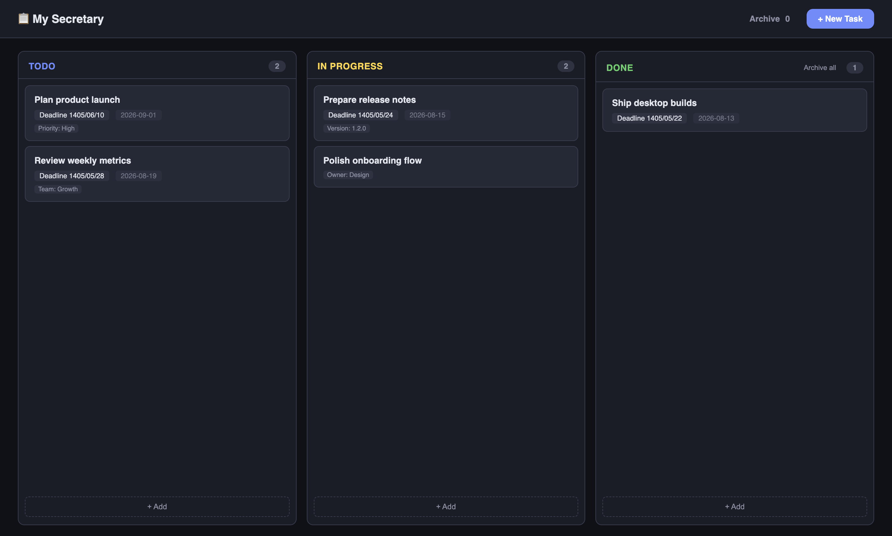
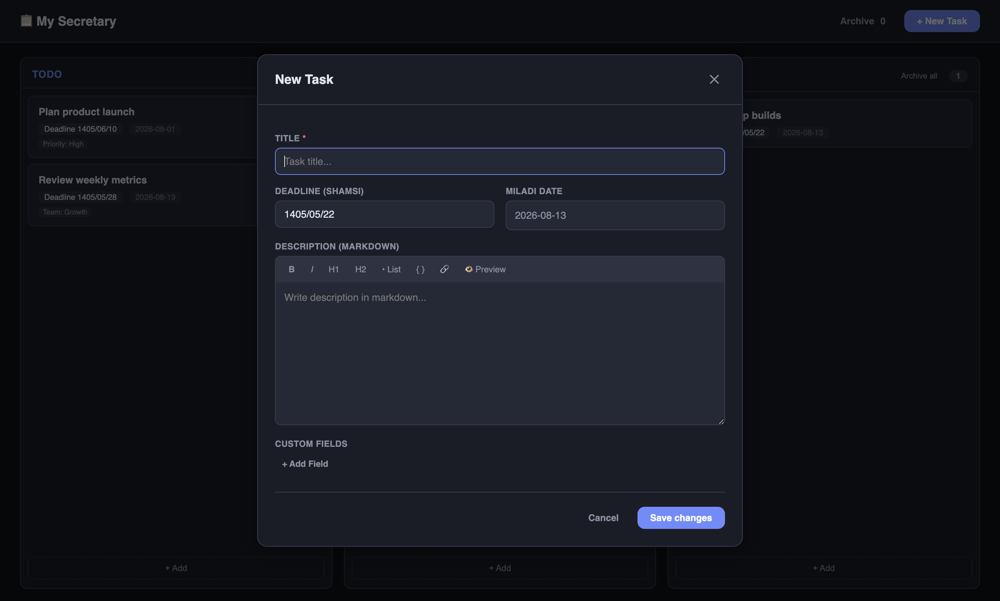

# My Secretary

My Secretary is a lightweight desktop task manager with a Kanban-style board. It runs locally on macOS and Windows and stores your tasks on your own computer.

## Screenshots

### Kanban board



### Task editor



## Features

- Kanban board with **Todo**, **In Progress**, and **Done** columns
- Drag and drop tasks between columns
- Persistent draft autosave while editing a task
- Manual **Save draft** and **Revert draft** actions
- One-click archiving of all completed tasks
- Archive viewer with individual **Restore to Done** actions
- Shamsi deadline input with automatic Gregorian date conversion
- Markdown task descriptions with formatting and preview
- Custom fields for additional task information
- Creation and update timestamps
- Local SQLite storage—your task database is not included in releases or uploaded to this repository

## Download

Download the latest installer from the [GitHub Releases page](https://github.com/mr-farshad-r/my-secretary/releases/latest):

- **Apple Silicon macOS:** download the ARM64 `.dmg`
- **Windows 64-bit:** download the `.exe` installer

## macOS installation

1. Download and open the ARM64 `.dmg` file.
2. Drag **My Secretary** into the **Applications** folder.
3. Open the app from Applications.

### “App is damaged” warning

The current macOS build is not signed or notarized with an Apple Developer certificate. macOS Gatekeeper may display:

> “My Secretary.app” is damaged and can’t be opened.

If you trust the release downloaded from this repository, open Terminal and remove the quarantine attribute:

```bash
xattr -dr com.apple.quarantine "/Applications/My Secretary.app"
```

Then open the app again. This is a temporary workaround until signed and notarized builds are available.

## Windows installation

1. Download the Windows `.exe` installer.
2. Run the installer and choose the installation directory.
3. If Windows SmartScreen appears, review the publisher information and continue only if you downloaded the installer from this repository.

## Data and privacy

All task data is stored locally in an SQLite database inside Electron's application-data directory. The database is excluded from Git and is never packaged into public releases.

Removing the application may not automatically remove its local database. Back up your application-data directory before reinstalling or moving to another computer if you need to preserve your tasks.

## Development

Requirements:

- Node.js 20 or newer
- npm

Install dependencies and run the app:

```bash
npm ci
npm start
```

Run with developer tools:

```bash
npm run dev
```

Build packages locally:

```bash
npm run dist:arm64
npm run dist:win
```

The Windows installer should normally be built on Windows.

## Releases

GitHub Actions builds macOS Apple Silicon and Windows x64 packages. Pushing a version tag that matches the version in `package.json` creates a public GitHub Release with both installers and automatically generated release notes.

Example:

```bash
git tag -a v1.1.0 -m "My Secretary v1.1.0"
git push origin v1.1.0
```

## License

MIT
